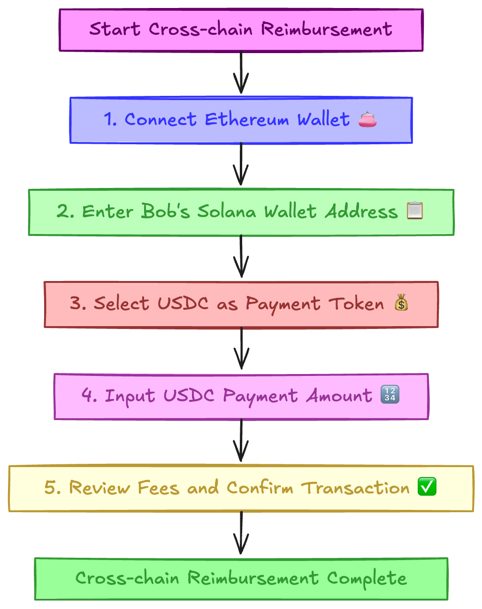

# Wormhole-Connect Cross-Chain Reimbursement Application

This project is a cross-chain reimbursement application based on [Wormhole Connect](https://wormhole.com/products/connect), designed to solve asset transfer issues between different blockchain networks through cross-chain technology.

## Project Overview

This project utilizes the Wormhole Connect component to support cross-chain asset transfers, such as USDC, between different blockchains like Ethereum and Solana. It is suitable for scenarios such as remote worker salary payments, international payments and settlements, decentralized organization (DAO) reimbursements, cross-chain business collaborations, and NFT market cross-chain settlements.

## Features

- Supports cross-chain asset transfers between Solana and Sepolia on the Testnet.
- Through the Wormhole Connect component, users can perform cross-chain operations directly within the application without leaving it.
- Custom UI theme for a better user experience.

## Use Cases

### Cross-Chain Reimbursement Case Study

In this project, we explore a specific case study to understand the application of cross-chain reimbursements. This case involves two roles: Alice and Bob, and how cross-chain technology can solve practical problems.

#### Case Background 🏢

Alice and Bob are two remote developers collaborating on a project. Bob has completed a task and needs Alice to pay him. However, they face a problem:

- **Alice** primarily operates on the **Ethereum** network, with her USDC assets on the Ethereum chain 🔷
- **Bob** mainly uses the **Solana** network and hopes to receive USDC payments directly on Solana ☀️
- Bob does not have an Ethereum account and does not want to create and manage a new account just for this transaction

#### Traditional Solutions and Their Issues ⚠️

Without cross-chain technology, possible solutions include:

1. **Bob creates an Ethereum account**: Increases Bob's management burden
2. **Alice creates a Solana account**: Increases Alice's complexity
3. **Using centralized exchanges**: Requires multiple transfers, waiting for deposits and withdrawals, and paying high fees
4. **Using third-party payment services**: May involve trust issues and additional costs

These solutions increase operational complexity, time costs, or economic costs.

#### Cross-Chain Solution 📝

Through cross-chain technology, Alice can efficiently complete the cross-chain reimbursement with the following simple steps:



## Real-World Applications 🌐

This cross-chain reimbursement model is suitable for various real-world scenarios:

- **Remote Worker Salary Payments** 👨‍💻
- **International Payments and Settlements** 🌍
- **Decentralized Organization (DAO) Reimbursements** 🏛️
- **Cross-Chain Business Collaborations** 🤝
- **NFT Market Cross-Chain Settlements** 🖼️

## Getting Started

First, install the project dependencies:

```bash
npm install
# or
yarn install
# or
pnpm install
# or
bun install
```

Then, run the development server:

```bash
npm run dev
# or
yarn dev
# or
pnpm dev
# or
bun dev
```

Open [http://localhost:3000](http://localhost:3000) in your browser to see the result.

You can start editing the page by modifying `app/page.tsx`. The page auto-updates as you edit the file.

## About Wormhole Connect

Wormhole Connect is a powerful cross-chain bridging tool designed to simplify asset transfers between different blockchain networks. Through Wormhole Connect, developers can easily integrate cross-chain functionality, supporting various blockchain networks such as Ethereum and Solana. It provides a rich API and configuration options, allowing developers to customize cross-chain operations according to their needs.

### Key Features

- **Simple Integration**: Integrate cross-chain functionality into your application with just a few lines of code.
- **Multi-Chain Support**: Supports various blockchain networks to meet different user needs.
- **Customizable Configuration**: Provides flexible configuration options, allowing developers to tailor it to their project requirements.

### Related Resources

- [Wormhole Connect Official Documentation](https://wormhole.com/products/connect) - Learn about Wormhole Connect's features and API.
- [Wormhole Connect GitHub Repository](https://github.com/wormhole-foundation/wormhole-connect) - View the source code and contribution guidelines.

You can find more information on the [Wormhole Connect Official Website](https://wormhole.com/products/connect).

## Deploying to Vercel

The easiest way to deploy your Next.js app is to use the [Vercel Platform](https://vercel.com/), provided by the creators of Next.js.

Check out our [Next.js Deployment Documentation](https://nextjs.org/docs/deployment) for more details.
